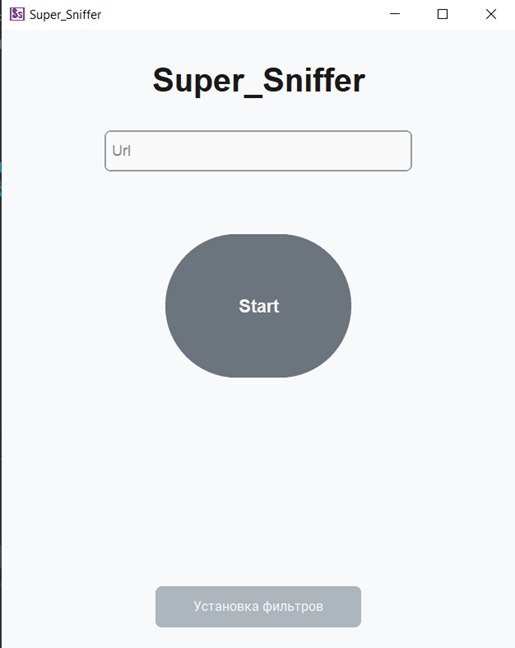
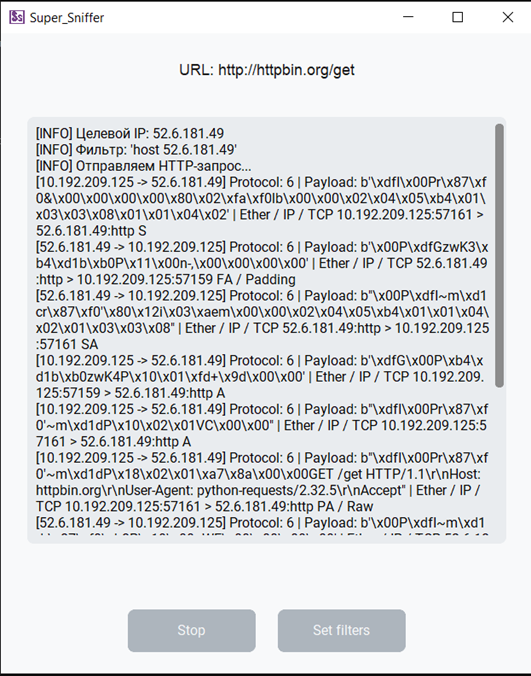
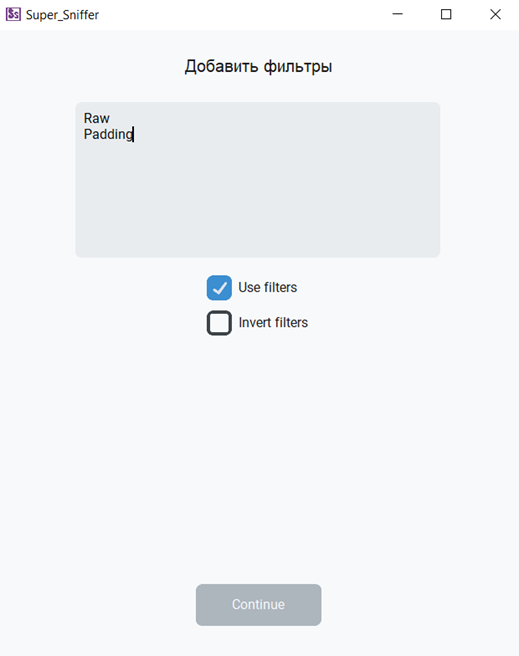

Программа Super_Sniffer предназначена для перехвата и анализа сетевого трафика, направленного к указанному веб-ресурсу. Для корректной работы приложения необходимо запускать его с правами администратора (в Windows — от имени администратора; в Linux/macOS — через sudo), а также иметь установленный пакет Npcap (для Windows) или аналогичный драйвер захвата пакетов.
Главное окно содержит в себе (см. Рисунок12):
-	Поле ввода «Url» — сюда необходимо ввести адрес веб-ресурса в формате http://example.com (рекомендуется использовать HTTP, а не HTTPS, так как зашифрованный трафик не поддаётся анализу содержимого).
-	Кнопка «Start» — крупная круглая кнопка в центре экрана. При нажатии программа преобразует URL в IP-адрес, автоматически отправляет HTTP-запрос к указанному ресурсу и начинает перехват связанных сетевых пакетов.
-	Кнопка «Установка фильтров» — расположена в нижней части окна. При её нажатии открывается окно настройки фильтров, позволяющее задать ключевые слова для отбора или исключения строк из вывода.

Окно вывода содержит в себе (см. Рисунок13):
-	В верхней части отображается целевой URL и его IP-адрес.
-	В центре — поле вывода данных, в котором в реальном времени появляются строки, описывающие перехваченные пакеты (IP-адреса, протокол, фрагмент полезной нагрузки). Поле доступно только для чтения.
-	Кнопка «Stop» — останавливает сниффинг и возвращает пользователя в главное окно.
-	Кнопка «Set filters» — открывает окно настройки фильтров без остановки сниффинга.

Окно настройки фильтров (см. Рисунок14):
-	Поле ввода фильтров — сюда вводятся ключевые слова, по одному на строку (например: HTTP, 200, GET).
-	Флажок «Use filters» — включает применение фильтров. Если отключён, все пакеты отображаются без ограничений.
-	Флажок «Invert filters» — инвертирует логику фильтрации: если включён, строки, содержащие ключевые слова, скрываются, а не отображаются.
-	Кнопка «Continue» — сохраняет настройки фильтров и возвращает пользователя в предыдущее окно (главное или окно вывода).

Рекомендации по эксплуатации:
-	Всегда используйте HTTP-адреса (например, http://httpbin.org/get) для наблюдения читаемого содержимого пакетов.
-	Для тестирования фильтров введите в поле фильтров, например, HTTP и включите «Use filters» — в выводе останутся только строки с этим словом.
-	При возникновении ошибки «Пожалуйста, введите URL» убедитесь, что поле ввода не пусто и содержит корректный адрес.
-	После завершения работы нажмите кнопку «Stop», чтобы корректно остановить сниффинг и освободить сетевой интерфейс

